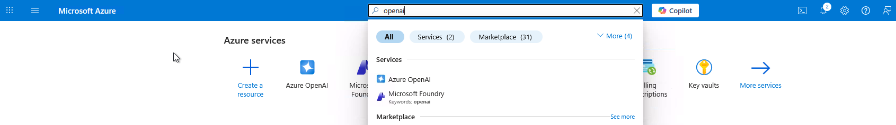
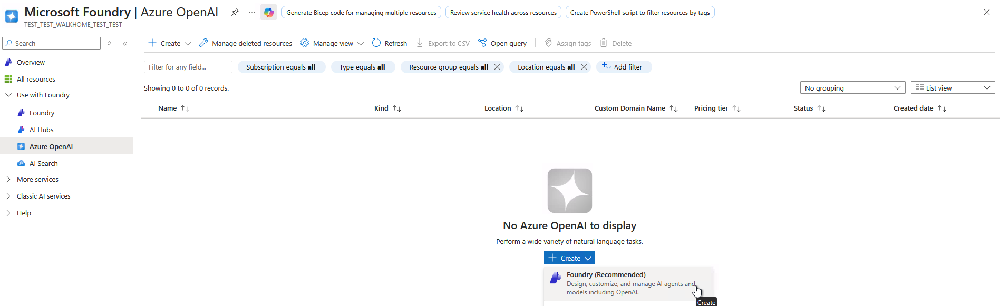
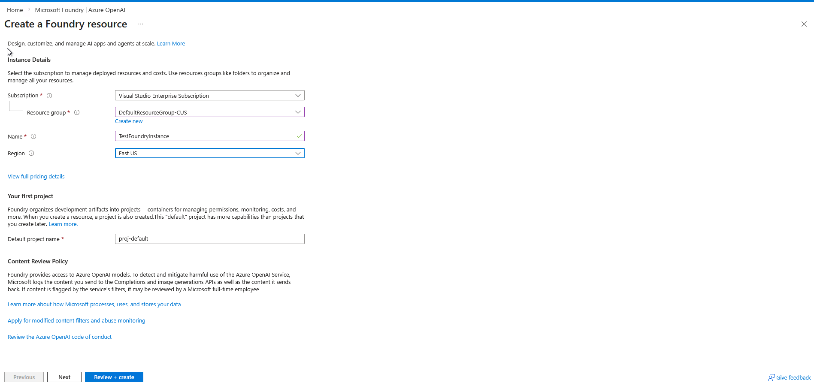
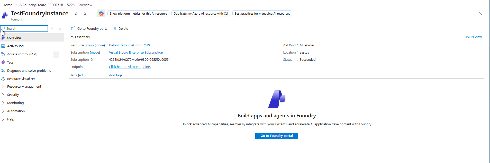
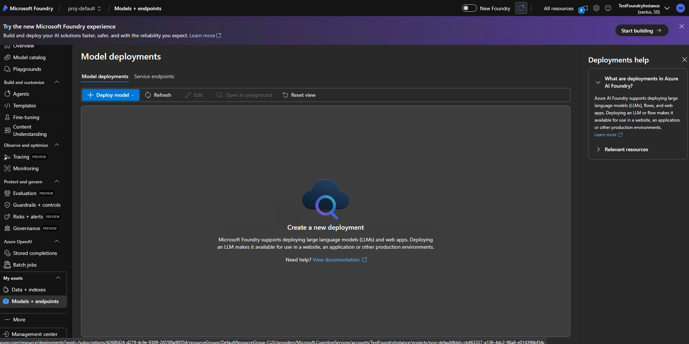
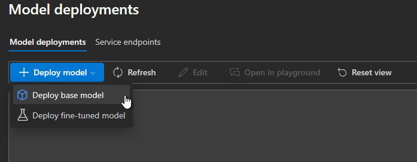
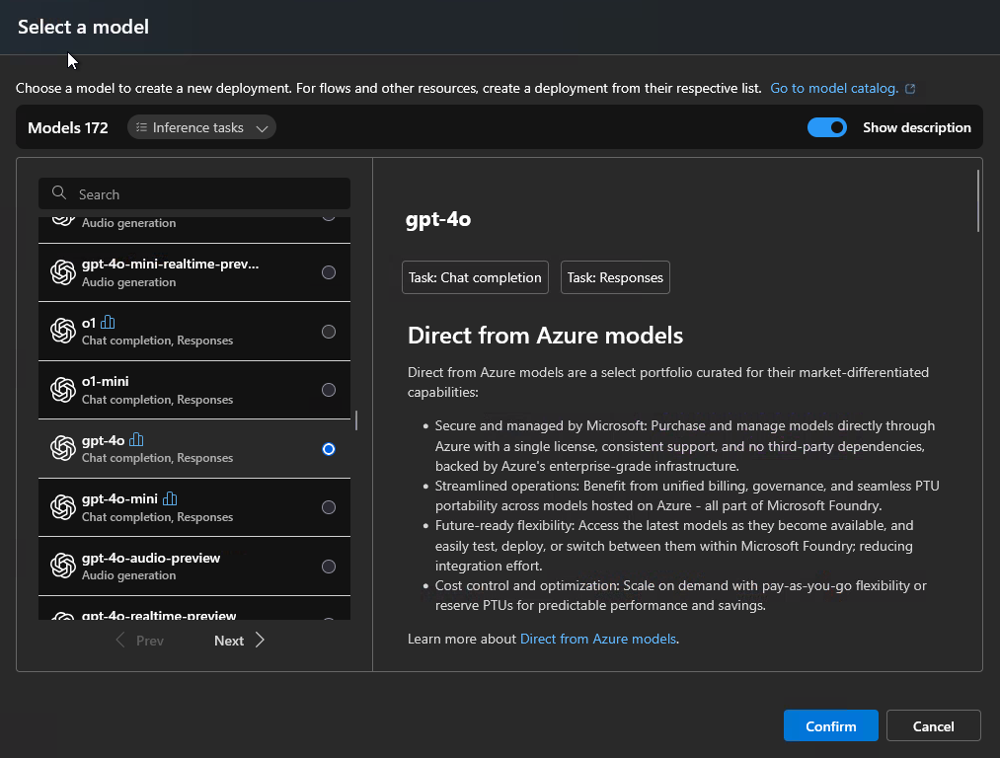
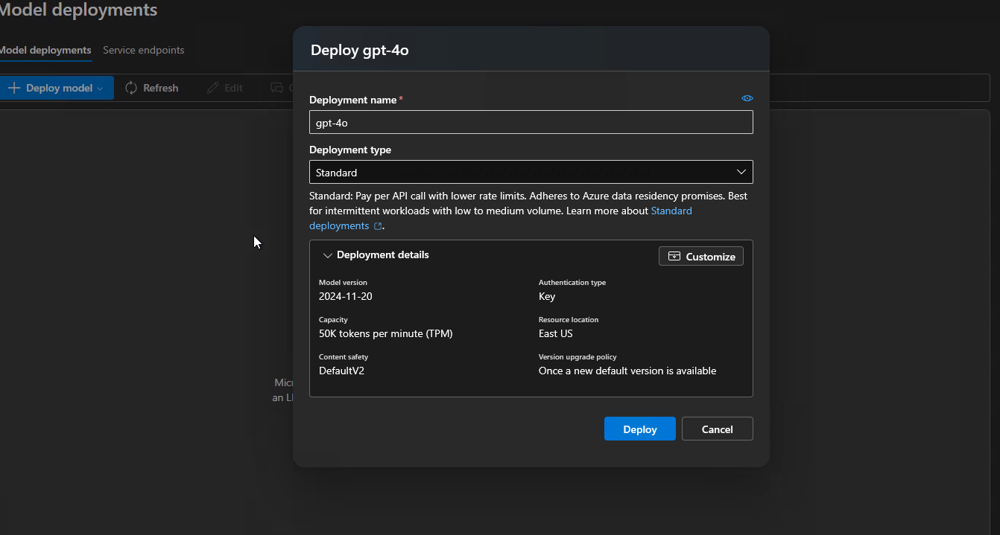
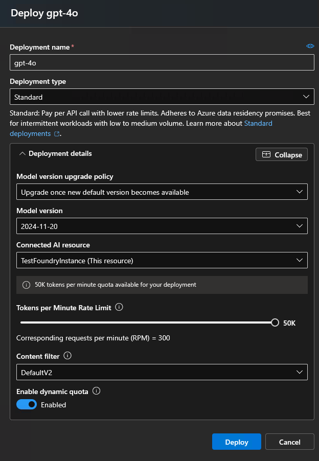
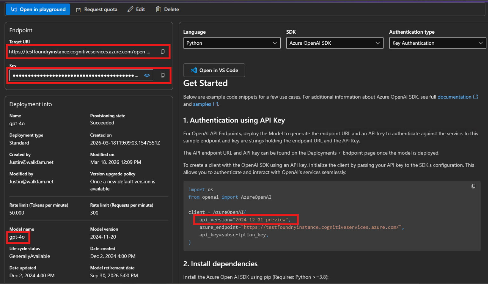

# M365 Copilot Agent Evaluations

> **🔒 PRIVATE PREVIEW:** This tool is currently in private preview. And the instructions below are for Private Preview.

A **zero-configuration** CLI for evaluating M365 Copilot agents. Send prompts to your agent, get responses, and automatically score them with Azure AI Evaluation metrics (relevance, coherence, groundedness).
- Send a batch (or interactive set) of prompts to a configured chat API endpoint.
- Collect agent responses and evaluate them locally using Azure AI Evaluation SDK.
- Metrics produced per prompt:
- - Relevance (1–5)
- - Coherence (1–5)
- - Groundedness (1–5)
- - Tool Call Accuracy (1–5)
- - Citations (0–1)
- Multiple input modes: command‑line list, JSON file, interactive.
- Multiple output formats: console (colorized), JSON, CSV, HTML (auto‑opens report).

## 📋 Prerequisites

- **M365 Copilot License** for your tenant
- **M365 Copilot Agent** deployed to your tenant (can be created with [M365 Agents Toolkit](https://learn.microsoft.com/en-us/microsoft-365/developer/overview-m365-agents-toolkit) or any other method)
- **Node.js 24.12.0+** (check: `node --version`)
- **Environment file** with your credentials and agent ID (see [Environment Setup](#-environment-setup) below)
- **Your Tenant ID** - get your tenant id using the instructions [here](https://learn.microsoft.com/en-us/azure/azure-portal/get-subscription-tenant-id) 
- **Azure OpenAI endpoint, and API key** (see [Getting Variables](#-getting-variables) below)

> Note: Authentication is currently supported on Windows only. Support for other operating systems is coming soon.

## 🔧 Environment Setup

### Install the Tool

1. Make sure you have Node.js
2. Run `npm install -g @microsoft/m365-copilot-eval`

### Setup Steps

Now, set up where you'll store your environment variables:

**Are you using M365 Agents Toolkit (ATK)?**
- - **Yes** → You already have `.env.local` in your project with `M365_TITLE_ID` (automatically used as your agent ID). Keep non-secret config there and put secrets like `AZURE_AI_API_KEY` in `.env.local.user` (never committed).
- - **No** → Create a new `env/.env.dev` file in your project directory. You'll add all variables there.

The CLI loads environment variables from multiple sources (in order of precedence):

1. **`.env.local`** in current directory (auto-detected, ideal for ATK projects)
2. **`.env.local.user`** in current directory — or **`env/.env.local.user`** — auto-loaded as a user-specific override (never commit this file; put secrets here)
3. **`env/.env.{environment}`** via `--env` flag (e.g., `--env dev` loads `env/.env.dev`)
4. **System environment variables**

#### Option 1: For M365 Agents Toolkit (ATK) Projects

ATK projects already check in `.env.local` with agent configuration. **Do not put secrets in `.env.local`** — use `.env.local.user` instead, which is loaded automatically and should be added to your `.gitignore`.

```bash
# .env.local (checked in — no secrets!)
# Already present from ATK:
M365_TITLE_ID="T_your-title-id-here"  # Auto-generated by ATK
```

```bash
# .env.local.user (NOT checked in — secrets go here)
AZURE_AI_OPENAI_ENDPOINT="<your-azure-openai-endpoint>"
AZURE_AI_API_KEY="<your-api-key-from-azure-portal>"
TENANT_ID="<your-tenant-id>"
```

Add `.env.local.user` to your `.gitignore`:

```gitignore
# User-specific secrets — never commit
.env.local.user
env/.env.local.user
```

#### Option 2: For Non-ATK Projects

Create `env/.env.dev` in your project directory:

```bash
# env/.env.dev (new file you create)
# Your agent ID (Optional):
M365_AGENT_ID="your-agent-id"  # e.g., U_0dc4a8a2-b95f-edac-91c8-d802023ec2d4

# You'll add these (see Getting Variables section below):
AZURE_AI_OPENAI_ENDPOINT="<your-azure-openai-endpoint>"
AZURE_AI_API_KEY="<your-api-key-from-azure-portal>"
AZURE_AI_API_VERSION="2024-12-01-preview"  # default
AZURE_AI_MODEL_NAME="gpt-4o-mini"           # default
TENANT_ID="<your-tenant-id>"
```

You can also override the agent ID at runtime: `runevals --m365-agent-id "custom-id"`

---

## 🔑 Getting Variables

Now that you know what's needed, here's how to get the required values:

### 1. Tenant ID

Your Azure Active Directory (AAD) tenant ID.

**How to obtain:**

1. Go to [Azure Portal](https://portal.azure.com)
2. Search for "Azure Active Directory" or "Microsoft Entra ID"
3. In the Overview section, you'll see **Tenant ID**
4. Copy this value - this is your `TENANT_ID`

Alternatively, if you have the Azure CLI installed:
```bash
az account show --query tenantId
```

### 2. Agent ID 
- If you have created your agent using Agents Toolkit, the tool automatically reads `M365_TITLE_ID` from `.env.local` and constructs the agent ID.
- If you don't know your agent-id, the tool offers agent selection when you try to submit a job. The agent selection has both the name, description, agent-id so that you can select the right agent.


### 3. Azure OpenAI Endpoint and API Key

You need both the endpoint URL and API key from your Azure OpenAI resource for "LLM as a Judge" evaluations. This Azure OpenAI endpoint can be in any tenant or account, and you will just configure the Evals tool using `AZURE_AI_OPENAI_ENDPOINT` and `AZURE_AI_API_KEY`.

**How to obtain:**

1. Go to [Azure Portal](https://portal.azure.com)
2. Open Azure Portal. Search OpenAI in the search bar and select Azure OpenAi. 

3. once you select Azure OpenAi, then Create an AI Foundry Resource. 

4. On the Create Foundry Resource, fill in the details and click 'Review + Create'.

5. Once the resource deployed, go to foundry portal 

6. At this point, you should be able to deploy an LLM model. 
7. Select Models + Endpoints on the left rail

8. Select Deploy Model -> Deploy base model (we recommend gpt-4o-mini model)

9. Select Confirm, then select Customize

10. Click on Customize and change the capacity to 50K tokens per minute


11. Hit deploy and wait for a few minutes for the model to deploy.
12. Once the deployment finishes, you are redirected to the API endpoint and API_Key page.
13. Copy the following values from that page.

14. Add all of these values to your `.env.dev` file as shown in the [Setup Steps](#setup-steps) above

**Required model:** Ensure you have `gpt-4o-mini` (or similar) deployed in your Azure OpenAI resource.

**Security tip:** Store keys and endpoints securely and never commit to source control.

## 🚀 Quick Start

Now that you have your environment variables set up, you're ready to run evaluations!

> **Important:** Run this tool FROM your M365 agent project directory (where your agent code lives), **not** from this repository. You don't need to clone or download this repo.

```bash
# Navigate to YOUR agent project directory
cd /path/to/your-agent-project

# Run evaluations (auto-discovers .env.local for ATK projects)
runevals

# Or specify an environment file
runevals --env dev
```

**No prompts file?** If you don't have a prompts file yet, the tool will offer to create a starter file with example prompts for you.

**Environment file lookup:**
- Checks `.env.local` first (ATK projects)
- Then checks `env/.env.{name}` if `--env {name}` is specified
- Prompts file auto-discovery works the same for all projects


---

## 📝 Creating Prompts Files

The CLI auto-discovers prompts files in your project:

### Auto-Discovery

When you run `runevals`, it searches:
1. Current directory: `prompts.json`, `evals.json`, `tests.json`
2. `./evals/` subdirectory: `prompts.json`, `evals.json`, `tests.json`

**Example project structure:**
```
my-agent/
├── .env.local              # Your credentials
├── evals/
│   └── evals.json         # Your test prompts (auto-discovered!)
└── .evals/
    └── 2025-12-03_14-30-45.html  # Generated reports
```

### Starter File Creation

If no file is found:
```
⚠️  No prompts file found in current directory or ./evals/

Create a starter evals file with sample prompts? (Y/n):
```

Answering "Y" creates `./evals/evals.json` with 2 starter prompts:

```json
[
  {
    "prompt": "What is Microsoft 365?",
    "expected_response": "Microsoft 365 is a cloud-based productivity suite..."
  },
  {
    "prompt": "How can I share a file in Teams?",
    "expected_response": "You can share a file in Teams by uploading it..."
  }
]
```

Edit this file with your own prompts and run again!

### Manual Creation

Create `./evals/prompts.json`:

```json
[
  {
    "prompt": "Your test prompt here",
    "expected_response": "Expected agent response"
  }
]
```

## 🎯 Usage Examples

> **Remember:** All commands below assume you're running them FROM your agent project directory, **not** from this repository.

### What to Expect

When you run an evaluation from your agent project directory, you'll see:
```bash
🚀 M365 Copilot Agent Evaluations CLI

📂 Loading environment: dev
🤖 Agent ID: T_my-agent.declarativeAgent
📄 Using prompts file: ./evals/evals.json

📊 Running evaluations...

─────────────────────────────────────────────────────────────

✓ Evals completed successfully!

Results saved to: ./evals/2025-12-03_14-30-45.html
```

**Commands to run from your project root:**

```bash
# Use .env.local (checked in current dir, then env/ folder)
runevals

# Use env/.env.dev configuration
runevals --env dev

# Use specific prompts file in your project
runevals --prompts-file ./evals/my-tests.json

# Inline prompts (no file needed, useful for quick tests)
runevals --prompts "What is Microsoft Graph?" --expected "Gateway to M365 data"

# Interactive mode (enter prompts interactively)
runevals --interactive

# Canonical logging verbosity
runevals --log-level debug
runevals --log-level info
runevals --log-level warning
runevals --log-level error

# Parallel prompt execution control
runevals --concurrency 5 --prompts-file ./evals/evals.json
runevals --concurrency 1000 --prompts-file ./evals/evals.json   # Python CLI clamps to 5

# Custom output location in your project
runevals --output ./reports/results.html
```

> **⚠️ Debug log safety notice:** The `--log-level debug` option is opt-in and may include raw API payloads and response data in console output. Redaction is pattern-based (API keys, tokens, passwords, long mixed-case strings) and **will not catch arbitrary PII or custom credentials** embedded in prompts or responses. Do not share debug-level output publicly without manual review.

### Optional: Add Shortcuts to package.json

You can add shortcuts (npm scripts) to your agent project's `package.json`:

```json
{
  "scripts": {
    "eval": "runevals",
    "eval:local": "runevals --env local",
    "eval:dev": "runevals --env dev"
  }
}
```

Then use shorter commands:

```bash
# Uses .env.local (ATK default)
npm run eval

# Uses env/.env.local
npm run eval:local

# Uses env/.env.dev
npm run eval:dev
```

**Production note:** For production environments, use CI/CD pipelines instead of local `npm run` commands. See [CICD_CACHE_GUIDE.md](CICD_CACHE_GUIDE.md) for examples.

## 📊 Output Formats

Results are automatically saved to `./evals/YYYY-MM-DD_HH-MM-SS.html` with:
- **Relevance** score (1-5)
- **Coherence** score (1-5)  
- **Groundedness** score (1-5)
- Per-prompt details and aggregate metrics

Other formats:
```bash
# JSON output
runevals --output results.json

# CSV output
runevals --output results.csv
```

## 🔧 Command Reference

```bash
Options:
  -V, --version                 output version number
  --log-level [level]           log level: debug|info|warning|error (bare flag -> info)
  --prompts <prompts...>        inline prompts to evaluate
  --expected <responses...>     expected responses (with --prompts)
  --prompts-file <file>         JSON file with prompts
  -o, --output <file>           output file (JSON, CSV, or HTML)
  -i, --interactive             interactive prompt entry mode
  --m365-agent-id <id>          override agent ID
  --env <environment>           environment name (default: dev)
  --init-only                   just setup, don't run evals
  -h, --help                    display help

Cache Commands:
  cache-info                    show cache statistics
  cache-clear                   remove cached Python runtime
  cache-dir                     print cache directory path
```

## ❓ Troubleshooting

### Pre-cache Python Environment (Optional)

If you want to set up the Python environment ahead of time without running evaluations:

```bash
runevals --init-only
```

This is useful for:
- Pre-warming the cache in CI/CD pipelines
- Testing the setup without running evaluations
- Troubleshooting installation issues

### Cache Issues
```bash
# View cache info
runevals cache-info

# Clear and rebuild
runevals cache-clear
runevals --init-only --log-level debug
```

### Network/Proxy Issues
```bash
# Set proxy
export HTTPS_PROXY=http://proxy:8080

# Retry with verbose output
runevals --init-only --log-level debug
```

### Permission Issues
```bash
# Check cache directory
runevals cache-dir

# Fix permissions (Unix/macOS)
chmod -R u+w $(runevals cache-dir)
```

## 📚 Advanced Documentation

- **[CI/CD Integration](./CICD_CACHE_GUIDE.md)** - GitHub Actions, Azure DevOps caching
- **[Testing Guide](./.github/TESTING_GUIDE.md)** - Cross-platform testing procedures
- **[Python CLI Guide](./PYTHON_CLI.md)** - Direct Python usage (without Node.js)
- **[Local Development Setup](./DEV_SETUP.md)** - Setting up the repo for local development


## Contributing

This project welcomes contributions and suggestions.  Most contributions require you to agree to a
Contributor License Agreement (CLA) declaring that you have the right to, and actually do, grant us
the rights to use your contribution. For details, visit [Contributor License Agreements](https://cla.opensource.microsoft.com).

When you submit a pull request, a CLA bot will automatically determine whether you need to provide
a CLA and decorate the PR appropriately (e.g., status check, comment). Simply follow the instructions
provided by the bot. You will only need to do this once across all repos using our CLA.

This project has adopted the [Microsoft Open Source Code of Conduct](https://opensource.microsoft.com/codeofconduct/).
For more information see the [Code of Conduct FAQ](https://opensource.microsoft.com/codeofconduct/faq/) or
contact [opencode@microsoft.com](mailto:opencode@microsoft.com) with any additional questions or comments.

## Schema Versioning

The eval document schema is versioned independently from the CLI, following [Semantic Versioning](https://semver.org/). This allows external consumers to depend on a stable contract without coupling to CLI release cycles.

- **Schema location**: [`schema/v1/eval-document.schema.json`](schema/v1/eval-document.schema.json)
- **Schema changelog**: [`schema/CHANGELOG.md`](schema/CHANGELOG.md)
- **Consumer quickstart**: [`specs/wi-6081652-dataset-schema-versioning/quickstart.md`](specs/wi-6081652-dataset-schema-versioning/quickstart.md)

### Eval Document Format

Eval documents should include a `schemaVersion` field:

```json
{
  "schemaVersion": "1.0.0",
  "items": [
    {
      "prompt": "What is Microsoft 365?",
      "expected_response": "Microsoft 365 is a cloud-based productivity suite."
    }
  ]
}
```

### Auto-Upgrade Behavior

When the CLI loads an eval document:

- **Legacy documents** (missing `schemaVersion`): Automatically upgraded with a timestamped backup (e.g., `file.json.bak.20260205143052`)
- **Older versions** (same major version): `schemaVersion` field updated without backup
- **Invalid documents**: CLI exits with an error message and guidance to review the schema changelog
- **Future versions**: CLI rejects with a message suggesting a CLI update

### Version Compatibility

Within a major version (e.g., 1.x.x), backward compatibility is guaranteed. Documents valid against 1.0.0 will remain valid against 1.1.0, 1.2.0, etc.

## Trademarks

This project may contain trademarks or logos for projects, products, or services. Authorized use of Microsoft
trademarks or logos is subject to and must follow
[Microsoft's Trademark & Brand Guidelines](https://www.microsoft.com/legal/intellectualproperty/trademarks/usage/general).
Use of Microsoft trademarks or logos in modified versions of this project must not cause confusion or imply Microsoft sponsorship.
Any use of third-party trademarks or logos are subject to those third-party's policies.

## Terms of Use

By using this tool, you agree to the [Microsoft Software License Terms](https://aka.ms/evaltoolterms).

See [LICENSE](./LICENSE) for the full license text.
